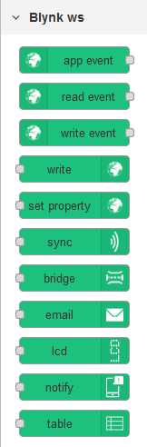
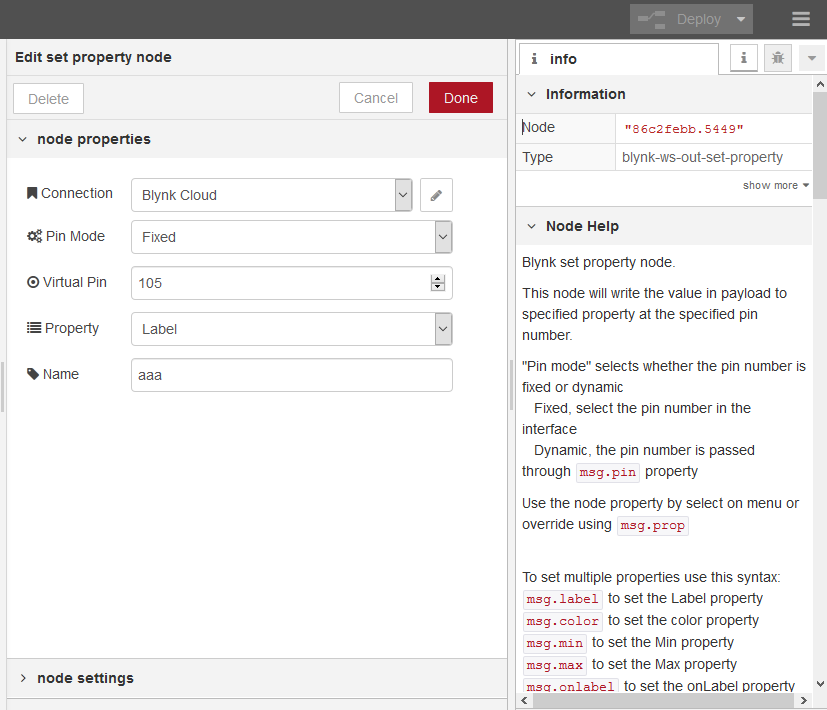
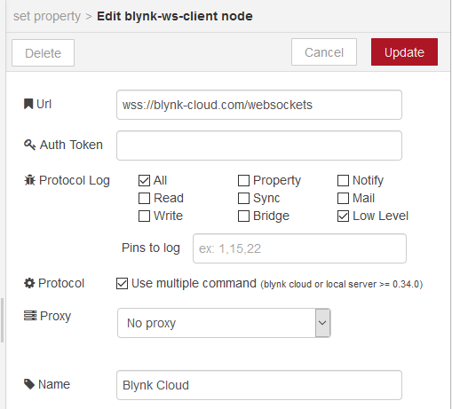

[](https://www.npmjs.com/package/node-red-contrib-blynk-ws)
[](https://www.npmjs.com/package/node-red-contrib-blynk-ws)
[](https://github.com/gablau/node-red-contrib-blynk-ws/stargazers)
[](https://github.com/gablau/node-red-contrib-blynk-ws/issues)
[](https://github.com/gablau/node-red-contrib-blynk-ws/blob/master/LICENSE)

[](https://www.npmjs.com/package/node-red-contrib-blynk-ws)

__________


# node-red-contrib-blynk-ws
Blynk library implementation for [Node-RED](https://nodered.org/) using WebSockets

## What is Blynk?
Blynk is a platform with iOS and Android apps to control Arduino, Raspberry Pi and the likes over the Internet.
You can easily build graphic interfaces for all your projects by simply dragging and dropping widgets.
If you need more information, please follow these links:

* [Kickstarter campaign](https://www.kickstarter.com/projects/167134865/blynk-build-an-app-for-your-arduino-project-in-5-m/description)
* [Blynk downloads, docs, tutorials](http://www.blynk.cc)
* [Blynk community](http://community.blynk.cc)
* [Facebook](http://www.fb.com/blynkapp)
* [Twitter](http://twitter.com/blynk_app)

## Node-RED blynk Websockets version
This library supports both SSL (wss://) and non secure (ws://) connection to local server and Blynk cloud server.
For local server, wss:// works only if you ve got a certificate installed.
For Blynk cloud server, you can use **ws://blynk-cloud.com/websockets** or with SSL **wss://blynk-cloud.com/websockets** as the server url.

If you installed Node Red globally use this command to install
```npm install --global node-red-contrib-blynk-ws```

### Supported events, commands and widgets

- read event
- write event
- app event
- write command
- bridge command
- sync command
- set property command
- emails widget
- notify widget
- LCD widget
- Table widget

### Changelog

See the [changelog](CHANGELOG.md) for all the details of each releases

### Node-RED palette



### Blynk App Settings

Use Raspberry PI as hardware to access 128 virtual pins or Generic Board for 32.

### How to use

See information panel on every nodes



### Debug

Use the verbose `-v` flag when starting Node-RED to get more information
or use `node-red-log` and enable log on Configuration Node as needed




### Compatibility

This library is retrocompatible and can replace **node-red-contrib-blynk-websockets**.
To do this:
- stop node-red 
- install node-red-contrib-blynk-ws `npm install node-red-contrib-blynk-ws`
- remove node-red-contrib-blynk-websockets `npm uninstall node-red-contrib-blynk-websockets`
- edit your flow file `eg: "my-flows.js"` search for _'blynk-websockets-'_ and replace with _'blynk-ws-'_
- start node-red.

__________

### Implementations for other platforms
* [Arduino](https://github.com/blynkkk/blynk-library)
* [Node.js, Espruino, Browsers](https://github.com/vshymanskyy/blynk-library-js)
* [Particle](https://github.com/vshymanskyy/blynk-library-spark)
* [Python, MicroPython](https://github.com/vshymanskyy/blynk-library-python)
* [OpenWrt](https://github.com/vshymanskyy/blynk-library-openwrt)
* [MBED](https://developer.mbed.org/users/vshymanskyy/code/Blynk/)
* [LabVIEW](https://github.com/juncaofish/NI-LabVIEWInterfaceforBlynk)
* [C#](https://github.com/sverrefroy/BlynkLibrary)

### Attributions

The **node-red-contrib-blynk-ws** was born as a fork of **node-red-contrib-blynk-websockets**
     [https://github.com/tzapu/node-red-contrib-blynk-websockets](https://github.com/tzapu/node-red-contrib-blynk-websockets)  
Some javascripts code was derived from **blynk-library-js**:   
     [https://github.com/vshymanskyy/blynk-library-js](https://github.com/vshymanskyy/blynk-library-js) 

### License
This project is released under The MIT License (MIT)
